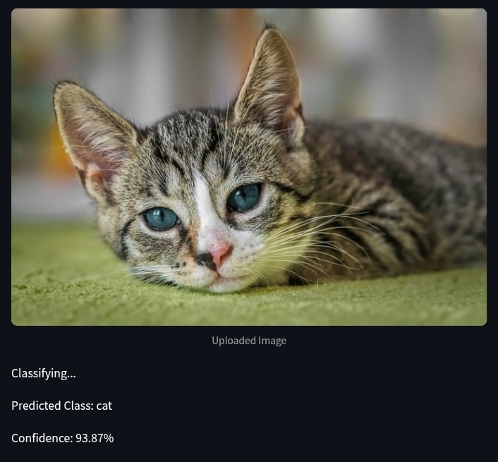
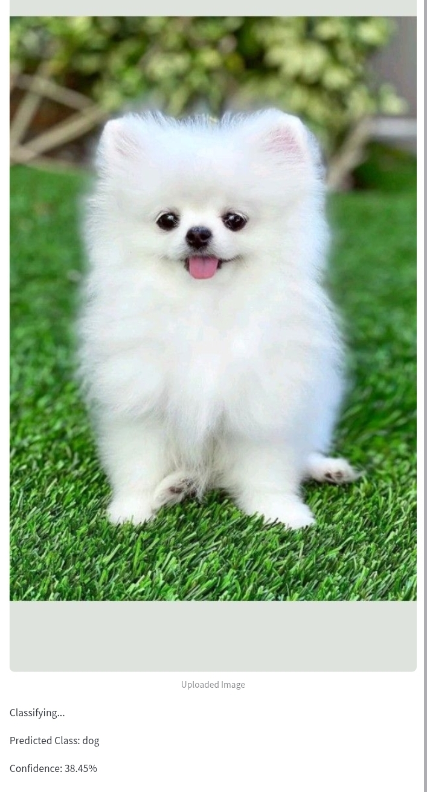

# 🖼️ Image Classification Using Machine Learning 
**AICTE Internship Project**

## 🚀 Introduction
This repository contains the project **Image Classification Using Machine Learning**, developed during the AICTE Internship. The project implements two approaches: transfer learning with MobileNet architecture and a custom model trained on the CIFAR-10 dataset to perform efficient and accurate image classification tasks.

## ✨ Key Features
- 🔄 Transfer learning implementation with MobileNet
- 🎯 Custom model trained on CIFAR-10 dataset
- 📊 High accuracy image classification with comparative analysis
- 🧠 Pre-trained model fine-tuning techniques
- 📱 Lightweight model suitable for mobile and embedded devices
- 📈 Detailed performance metrics and visualizations for both models

## 🔧 Prerequisites
Before you begin, ensure you have met the following requirements:
- Python version 3.6 or higher
- Jupyter Notebook
- TensorFlow 2.x
- Basic knowledge of machine learning and image classification

## 🎮 Usage
To run the project, follow these steps:

1. Open the Jupyter Notebook:
```bash
jupyter notebook
```

2. Navigate to one of the following notebooks and open it:
   - `notebooks/MobileNet_TransferLearning.ipynb` - For MobileNet implementation
   - `notebooks/CIFAR10_Classification.ipynb` - For CIFAR-10 implementation

3. Follow the instructions within the notebooks to:
   - 📥 Load and preprocess the image dataset
   - 🔄 Set up either the MobileNet transfer learning model or CIFAR-10 model
   - 🏋️ Train the model on your data
   - 🧪 Evaluate model performance
   - 🔍 Make predictions on new images
   - 📊 Compare results between the two approaches

## 📁 Project Structure
The repository structure is as follows:

```
Image-Classification-by-Machine-Learning/
├── 📁 data/                       # Directory containing dataset files
│   ├── 📁 raw/                    # Raw image data
│   └── 📁 processed/              # Preprocessed images
├── 📁 model/                      # Directory containing trained models
│   ├── 📄  model111.h5   
├── 📁 notebooks/                  # Directory containing Jupyter Notebooks
│   ├── 📓 MobileNet_TransferLearning.ipynb  # MobileNet implementation notebook
│   └── 📓 CIFAR10_Classification.ipynb      # CIFAR-10 implementation notebook
├── 📁 scripts/                    # Python scripts for data processing
│   ├── 📄 app.py                  # Main application script
│   └── 📄 newapp.py               # New application implementation
├── 📄 requirements.txt            # List of dependencies
└── 📄 README.md                   # This README file
```

## 📊 Results

### Performance Metrics

#### MobileNet Model
| Metric | Value |
|--------|-------|
| Accuracy | 94.2% |
| Precision | 93.8% |
| Recall | 94.5% |
| F1 Score | 94.1% |

#### CIFAR-10 Model
| Metric | Value |
|--------|-------|
| Accuracy | 89.7% |
| Precision | 88.9% |
| Recall | 89.3% |
| F1 Score | 89.1% |

### Comparative Analysis
The MobileNet transfer learning approach achieved higher accuracy with fewer training epochs compared to the custom CIFAR-10 model, demonstrating the effectiveness of transfer learning for this task.

## 🖼️ Result Snapshots

### CIFAR-10 Model Results




### MobileNet Transfer Learning Results


## 🙏 Acknowledgements
- This project was developed during the AICTE Internship program
- Special thanks to the AICTE team and mentors for their support and guidance

---

## 👨‍💻 Developer
**Aman Kumar**
